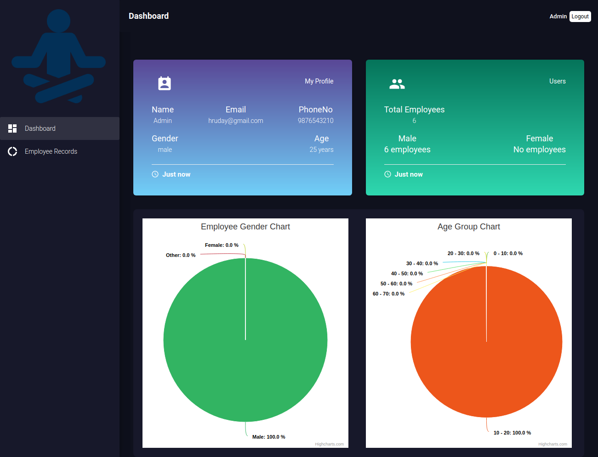
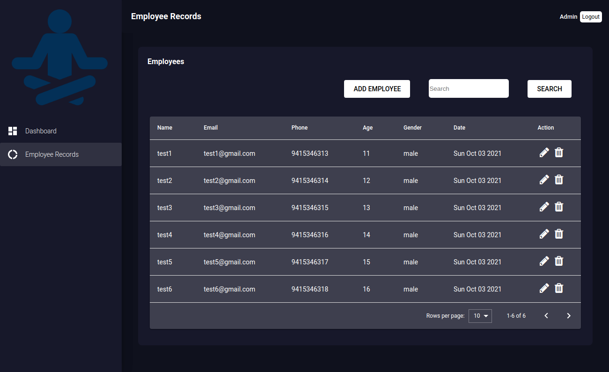

# OrgManage
Organization employee tasks and view reports using react application

This is a open project to manage organization employees.

# Login
Use below login credentials
* Email: hruday@gmail.com
* Password: hruday123

# Features
1. React js application
2. Redux for storage
3. Persisted storage
4. UI and theme
5. Material theme and components
6. Responsive for tabs, laptops and pcs
7. Form validations
8. Login page
9. Encrypted passwords data
10. Notifications
11. Dashboard graphs
   1. Gender wise graph
   2. Age group wise graph
12. Employee Manage
   3. Create employee
   4. Edit employees
   5. Delete employees
   6. Employee listing with pagination
   7. Search employees by name, email, age, phone and gender

# Stacks:
"react": 16.8.6,
"node": 12.22.4,
"npm": 6.14.14,
"react-scripts": "3.0.1",
"redux": "^4.0.5",
"@amcharts/amcharts4": "^4.10.7",
"@date-io/date-fns": "^1.3.11",
"@material-ui/core": "4.1.0",
"@material-ui/icons": "4.1.0",
"@material-ui/pickers": "^3.2.6",

other libraries
highcharts, react-notifications, classnames

# Setup and run
1. run `npm install`
2. run `npm start`
3. open browser and paste `http://localhost:3000`

# Below are images of project
# Login page
Use below login credentials
* Email: hruday@gmail.com
* Password: hruday123

# Dashboard

# Manage employees

